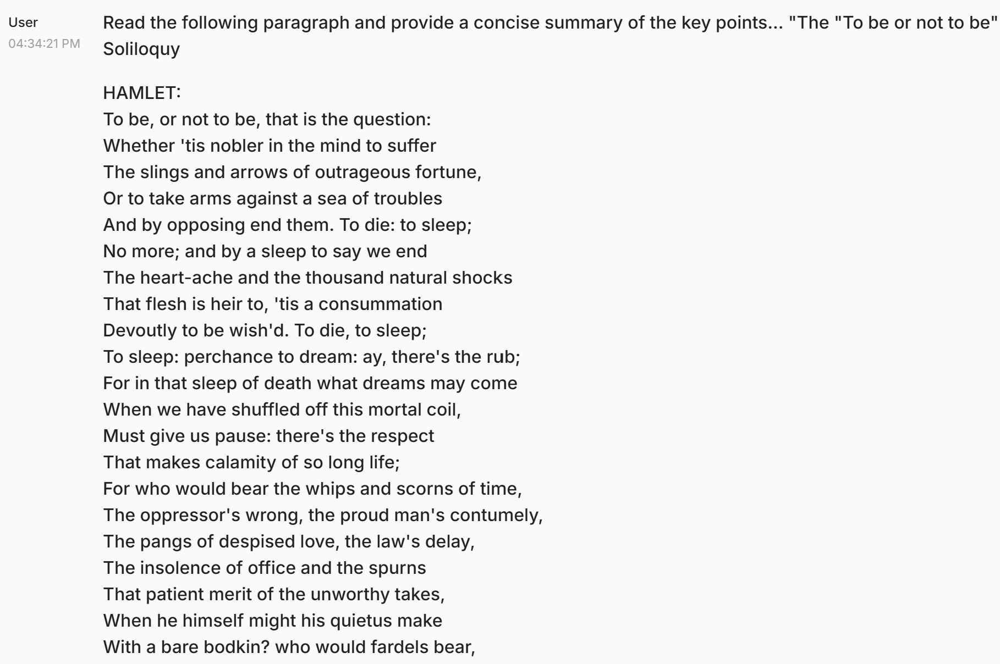
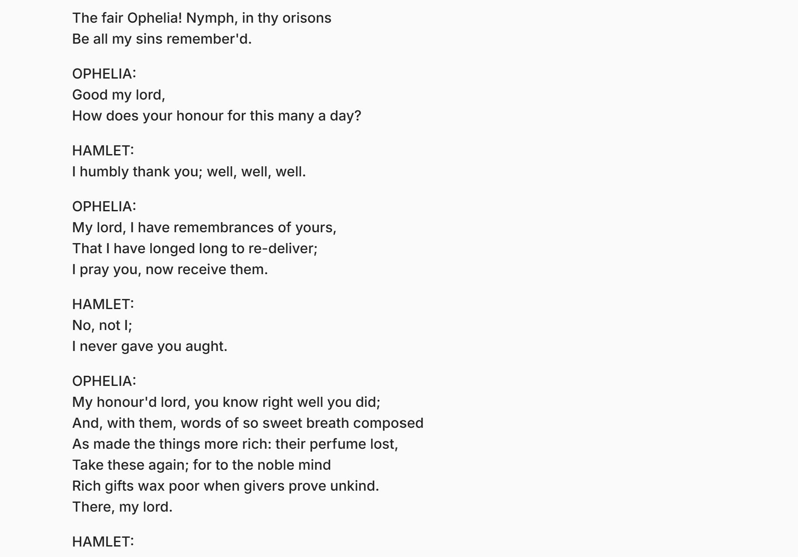
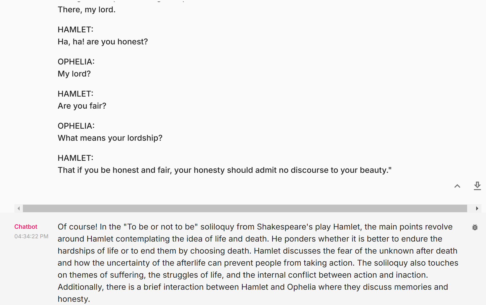

🏗️ Activity #1:
Please evaluate your system on the following questions:

* 1. **Explain the concept of object-oriented programming in simple terms to a complete beginner.**   

* Aspect Tested:  
(1) Nature of tone and language: Is the chatbot providing a friendly and natural tone?  
(2) Clarity and Simplicity: Is the narrative used for explanation easy to understand for non-technical or beginner-level audience? Is it avoiding technical jargon? Will readers be able to understand the concept?  
(3) Degree of engagement: Is the reply welcoming and engaging for the user to drive repeat interactions in the future?  

Result:

* 2. Read the following paragraph and provide a concise summary of the key points…  
The "To be or not to be" Soliloquy

HAMLET:
To be, or not to be, that is the question:
Whether 'tis nobler in the mind to suffer
The slings and arrows of outrageous fortune,
Or to take arms against a sea of troubles
And by opposing end them. To die: to sleep;
No more; and by a sleep to say we end
The heart-ache and the thousand natural shocks
That flesh is heir to, 'tis a consummation
Devoutly to be wish'd. To die, to sleep;
To sleep: perchance to dream: ay, there's the rub;
For in that sleep of death what dreams may come
When we have shuffled off this mortal coil,
Must give us pause: there's the respect
That makes calamity of so long life;
For who would bear the whips and scorns of time,
The oppressor's wrong, the proud man's contumely,
The pangs of despised love, the law's delay,
The insolence of office and the spurns
That patient merit of the unworthy takes,
When he himself might his quietus make
With a bare bodkin? who would fardels bear,
To grunt and sweat under a weary life,
But that the dread of something after death,
The undiscover'd country from whose bourn
No traveller returns, puzzles the will
And makes us rather bear those ills we have
Than fly to others that we know not of?
Thus conscience does make cowards of us all;
And thus the native hue of resolution
Is sicklied o'er with the pale cast of thought,
And enterprises of great pith and moment
With this regard their currents turn awry,
And lose the name of action.--Soft you now!
The fair Ophelia! Nymph, in thy orisons
Be all my sins remember'd.

OPHELIA:
Good my lord,
How does your honour for this many a day?

HAMLET:
I humbly thank you; well, well, well.

OPHELIA:
My lord, I have remembrances of yours,
That I have longed long to re-deliver;
I pray you, now receive them.

HAMLET:
No, not I;
I never gave you aught.

OPHELIA:
My honour'd lord, you know right well you did;
And, with them, words of so sweet breath composed
As made the things more rich: their perfume lost,
Take these again; for to the noble mind
Rich gifts wax poor when givers prove unkind.
There, my lord.

HAMLET:
Ha, ha! are you honest?

OPHELIA:
My lord?

HAMLET:
Are you fair?

OPHELIA:
What means your lordship?

HAMLET:
That if you be honest and fair, your honesty should admit no discourse to your beauty.

* Aspect Tested:  
(1) Thoughtful Reflection of mood and tone: Is the reply capturing the existential and philosophical undertones of the text?  
(2) Effectiveness and exhaustiveness of summarization:  
(a) Is the reply providing a clear, impactful, and insightful summary without compromising on the richness of the original literature?  
(b) Is the reply capturing all distinct ideas, points, and themes of the paragraph?  

Result:
<!-- 
 -->

