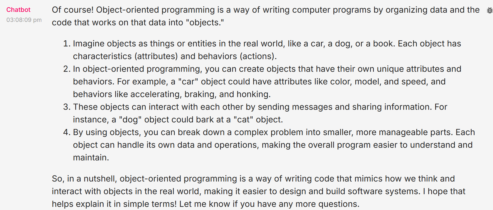

🏗️ Activity #1:
Please evaluate your system on the following questions:

Explain the concept of object-oriented programming in simple terms to a complete beginner.  
Aspect Tested: 
(1) Nature of tone and language: Is the chatbot providing a friendly and natural tone?  
(2) Clarity and Simplicity: Is the narrative used for explanation easy to understand for non-technical or beginner-level audience? Is it avoiding technical jargon? Will readers be able to understand the concept?  
(3) Degree of engagement: Is the reply welcoming and engaging for the user to drive repeat interactions in the future?  

Result:

